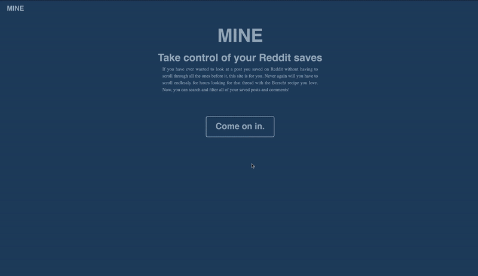

# Mine. A useful Reddit utility
### Visit Site => [Mine](http://mineapp-env.eba-nxjz2ubz.us-east-2.elasticbeanstalk.com/)

  

Mine solves a really annoying problem. If you save a lot of posts or comments on reddit you know it's not easy to find the old ones.  Your only option is to scroll endlessly until you find what you're looking for. This is really painful if you have a lot of posts saved.

I thought it would be a great exercise to get more familiar with LiveView and Elixir while also being something I could use myself.

Mine is a basic website that connects to your reddit account and loads all of your saved posts and comments.  It enables you to filter by type(post or comment) or search the contents of titles and comment bodies. All doable in realtime thanks to Phoenix LiveView. Mine does not store any user data permanently. In order avoid having the call the api everytime you search/filter, Mine uses ETS (Erlang Term Storage) to cache data from the initial request so it remains available during the session.

## Features
1. View all (most recent saves appear first)
2. View only Posts (sorted alphabetically by subreddit name)
3. View only Comments (most recent saves appear first)
4. Combined filter/search
   * all / text search
   * posts / text search
   * comments / text search


## Installation
1. Install elixir and OTP if you don't already have it. (see `mix.exs` for versions)
2. Clone the repository to your local drive
3. Visit [Reddit API Wiki](https://www.reddit.com/wiki/api), register for an API KEY 
and follow the directions for creating an app.
    * If you want to run locally and also deploy to production you will need to create two apps on Reddit.
4. Create a .env file in the apps root folder. Add to your .`gitignore` file
5. Set the following environment variables in the .env file using the values from the app that you will use for production.
   * `SECRET_KEY_BASE`  (create by typing `mix phx.gen.secret` in the terminal)
   * `REDDIT_CLIENT_ID`
   * `REDDIT_API_KEY`
   * `REDDIT_REDIRECT_URI` (https://produrl.com/saved where produrl.com = your site)
6. Create a `dev.secrets.exs` file in the `config/` directory and confirm the file is listed in your `.gitignore` file
  
7. In your `dev.secrets.exs` file, set the same env vars listed above using the values from the second app you created on Reddit.
   * `REDDIT_REDIRECT_URI` should be set to http://localhost:4000/saved  
  ```elixir
  #dev.secrets.exs

  use Mix.Config

  reddit_api_key = value
  reddit_client_id = value
  reddit_redirect_uri = value
  secret_key_base = value

  config :mine, secret_key_base: secret_key_base
  config :mine, reddit_api_key: reddit_api_key
  config :mine, reddit_client_id: reddit_client_id
  config :mine, reddit_redirect_uri: reddit_redirect_uri
  ```

8. Add `import_config "dev.secret.exs"` to the bottom of `dev.exs` if not already there. (should be though).
9. In the terminal, run the following commands
   * `mix deps.get`
   * `cmd npm install --prefix assets`
   * `mix phx.server`
10.  Visit localhost:4000 in your browser and the app should load
11.  After installation/setup, only `mix phx.server` is needed to start the app

## Deploy to Production
If you would like to deploy to production you can create a release by following the guide linked below in combination with your hosting service requirements: \
[Phoenix Releases](https://hexdocs.pm/phoenix/releases.html)  

As is, the app is set up to deploy via a CI/CD pipeline using Travis, Docker, and AWS Elastic Beanstalk. However, it can be easily modified to run on Heroku alone without Docker & Travis CI by adding/changing a few settings in the config files. The release guide linked previously has some info on Heroku realeases.

## Future Improvements
1. The current implementation of ETS for caching is extremely simple, running only in the Liveview file.  Due to this, the api client must request and store all saved data before storing it in ETS and loading the page. This requires multiple requests in a row because reddit limits responses to only 25 entries per request.  Ideally, ETS would be implemented in it's own process so that it would be accessible during requests and the site could serve results from each request as they come in instead of waiting to load them all at once.
2. Add multiple sorting options. i.e. alphabetically, date saved, subreddit name, etc...
3. I believe the implementation of several functions in the api client module (`reddit.ex`) have the potential to be improved upon. Additionally, the app would benefit from typespecs being implemented.

**Inspiration:** \
This project was orginally inspired by this post on reddit:
[Made an app, lets you find...](https://www.reddit.com/r/reactjs/comments/cs0qdx/made_an_app_lets_you_find_all_your_reddit_saves/).

